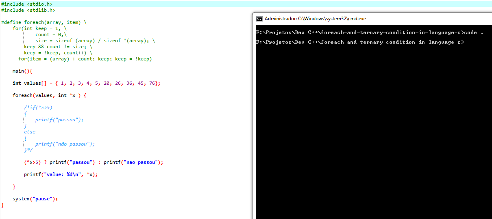

<kbd>

</kbd>
 
<h1>Teste de Foreach e Condição Ternária em C</h1>

Antes de começar você precisará ter instalado em sua máquina o seguite:

<ul>
    <a href="https://git-scm.com">Git: https://git-scm.com</a>
     
    <a href="https://sourceforge.net/projects/orwelldevcpp/">Um compilador C: https://sourceforge.net/projects/orwelldevcpp/</a>    
     
</ul>

### Rodando o Site

<ul>
    <li>Abra o arquivo foreach aperte a tecla F11 se estiver usando o Dev C++, caso contrário compile e execute o código na sua IDE. </li>
</ul>

### Tecnologias

As seguintes ferramentas foram usadas na construção do projeto:

<ul>
    <li>Linguagem C</li>
</ul>

### Autor

<a href="">
 
  
 <b>Carlos Eduardo</b></a>

Feito com ❤️ por Carlos Eduardo

<a href="mailto:carloseduardodiasbatista@gmail.com">Entre em contato</a>

